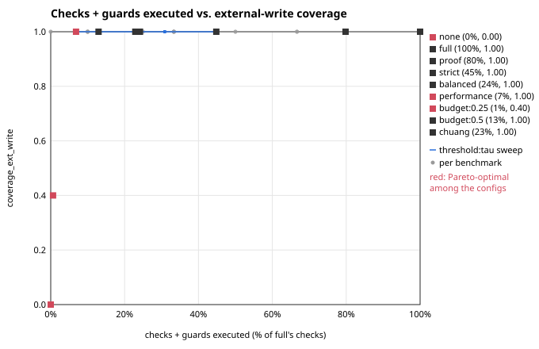
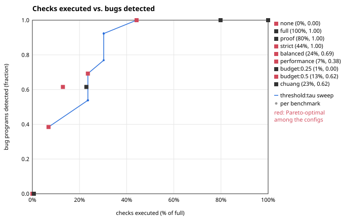

# NovaCraft risk-adaptive bounds-check hardening: evaluation results

Generated by `eval/report.ts` from the raw files in `results/raw/` (written by `eval/run.ts`). Do not edit by hand; run `npm run eval`.

Environment: Node v22.22.0 (V8 12.4.254.21-node.33), linux 6.18.44-fc-v77 x64, Intel(R) Xeon(R) Processor @ 2.80GHz x4. Run started 2026-10-07T12:41:47.503Z. Input scale 10; timing: 5 warm-up + 30 timed calls per kernel and configuration, whole timing pass repeated 2 times. Default weights wP=0.4, wC=0.35, wW=0.25.

**What these benchmarks are.** The 16 kernels in `bench/` are small NovaCraft ports of PolyBench-style kernels written for this project, not PolyBench itself (NovaCraft cannot compile C). Arrays are flattened to 1D. All inputs are generated from fixed seeds, are identical across configurations, and keep every access in bounds. Timing is V8 only, on one machine.

Configurations: `none`, `full`, `proof`, `strict`, `balanced`, `performance`, `budget:0.25`, `budget:0.5`, `chuang`. The main cost metric is **checks executed** (counter-instrumented build, deterministic). Runtime is reported separately with its measured noise.

## Correctness on benign inputs

Every configuration (main and tau sweep) produced the same return value and final array contents as `full` on every benchmark (480 runs).

## Static decisions

Per benchmark under `strict` (proof elimination + loop versioning, nothing omitted). "versionable" counts unproven sites whose loop matches the versioning pattern.

| benchmark | sites | proven | hoisted | retained | ext. writes | code size full / strict (bytes) |
|---|---|---|---|---|---|---|
| sumArray | 1 | 1 | 0 | 0 | 0 | 386 / 347 |
| prefixSum | 3 | 3 | 0 | 0 | 0 | 536 / 401 |
| dot | 2 | 1 | 1 | 0 | 0 | 578 / 774 |
| axpy | 4 | 0 | 3 | 1 | 0 | 751 / 1029 |
| matvec | 4 | 0 | 2 | 2 | 0 | 981 / 2387 |
| stencil | 5 | 0 | 0 | 5 | 0 | 785 / 785 |
| stencilV | 5 | 0 | 4 | 1 | 0 | 790 / 1255 |
| smooth | 3 | 0 | 0 | 3 | 1 | 868 / 868 |
| smoothV | 3 | 0 | 2 | 1 | 1 | 881 / 1948 |
| histogram | 4 | 1 | 0 | 3 | 1 | 665 / 626 |
| bubbleSort | 5 | 0 | 0 | 5 | 0 | 950 / 950 |
| insertionSort | 5 | 1 | 0 | 4 | 0 | 999 / 948 |
| binarySearch | 2 | 1 | 0 | 1 | 0 | 997 / 940 |
| gather | 4 | 1 | 1 | 2 | 0 | 680 / 901 |
| scatter | 4 | 1 | 1 | 2 | 1 | 681 / 899 |
| reverse | 5 | 0 | 2 | 3 | 1 | 785 / 1190 |

Across all kernels: 59 sites, 10 proven (16.9%), 16 hoisted under strict (27.1%). Analysis proves every site in: sumArray, prefixSum; it proves no site in: axpy, matvec, stencil, stencilV, smooth, smoothV, bubbleSort, reverse.
- `stencil` (natural form): 0 of 5 sites hoisted; `stencilV` (versionable variant): 4 of 5.
- `smooth` (natural form): 0 of 3 sites hoisted; `smoothV` (versionable variant): 2 of 3.

Decision counts summed over all kernels, per configuration:

| config | eliminated | hoisted | retained | omitted | code size (sum, bytes) |
|---|---|---|---|---|---|
| none | 0 | 0 | 0 | 59 | 9010 |
| full | 0 | 0 | 59 | 0 | 12313 |
| proof | 10 | 0 | 49 | 0 | 11821 |
| strict | 10 | 16 | 33 | 0 | 16248 |
| balanced | 10 | 2 | 12 | 35 | 10923 |
| performance | 10 | 1 | 4 | 44 | 9829 |
| budget:0.25 | 10 | 2 | 14 | 33 | 10856 |
| budget:0.5 | 10 | 5 | 20 | 24 | 12283 |
| chuang | 10 | 0 | 15 | 34 | 9925 |

## Checks executed (main cost metric)

Dynamic bounds checks executed on the benchmark input, as a percentage of `full`. Loop-versioning guards are counted separately (one guard evaluation per entry into a versioned loop).

| benchmark | full (count) | proof | strict | balanced | performance | budget:0.25 | budget:0.5 | chuang | strict guards |
|---|---|---|---|---|---|---|---|---|---|
| sumArray | 2000000 | 0.0% | 0.0% | 0.0% | 0.0% | 0.0% | 0.0% | 0.0% | 0 |
| prefixSum | 5999997 | 0.0% | 0.0% | 0.0% | 0.0% | 0.0% | 0.0% | 0.0% | 0 |
| dot | 4000000 | 50.0% | 0.0% | 0.0% | 0.0% | 0.0% | 0.0% | 0.0% | 1 |
| axpy | 6000001 | 100.0% | 0.0% | 0.0% | 0.0% | 0.0% | 0.0% | 33.3% | 1 |
| matvec | 3201716 | 100.0% | 50.0% | 50.0% | 0.0% | 0.0% | 0.0% | 0.0% | 1266 |
| stencil | 7999993 | 100.0% | 100.0% | 0.0% | 0.0% | 0.0% | 25.0% | 25.0% | 0 |
| stencilV | 7999993 | 100.0% | 0.0% | 0.0% | 0.0% | 0.0% | 0.0% | 25.0% | 1 |
| smooth | 4999921 | 100.0% | 100.0% | 100.0% | 10.0% | 10.0% | 10.0% | 10.0% | 0 |
| smoothV | 4999921 | 100.0% | 0.0% | 0.0% | 0.0% | 0.0% | 0.0% | 10.0% | 499993 |
| histogram | 6000001 | 66.7% | 66.7% | 66.7% | 33.3% | 0.0% | 33.3% | 33.3% | 0 |
| bubbleSort | 5382059 | 100.0% | 100.0% | 0.0% | 0.0% | 0.0% | 16.6% | 33.2% | 0 |
| insertionSort | 3204988 | 99.9% | 99.9% | 0.0% | 0.0% | 0.1% | 0.1% | 50.0% | 0 |
| binarySearch | 2500300 | 92.0% | 92.0% | 92.0% | 0.0% | 0.0% | 0.0% | 0.0% | 0 |
| gather | 6000001 | 66.7% | 33.3% | 33.3% | 0.0% | 0.0% | 33.3% | 33.3% | 1 |
| scatter | 6000001 | 66.7% | 33.3% | 33.3% | 33.3% | 0.0% | 33.3% | 33.3% | 1 |
| reverse | 4000001 | 100.0% | 50.0% | 50.0% | 25.0% | 0.0% | 25.0% | 50.0% | 1 |

Summed over all kernels (80288893 checks under full): proof 79.8%, strict 44.2%, balanced 23.5%, performance 6.9%, budget:0.25 0.6%, budget:0.5 12.9%, chuang 22.9%.

## Coverage

protected(site) = proven, hoisted or retained. coverage = protected / all sites; coverage_ext_write = protected external-index writes / all external-index writes (static, summed over kernels).

| config | coverage | coverage_ext_write | checks executed (% of full) |
|---|---|---|---|
| none | 0.17 | 0.00 | 0.0% |
| full | 1.00 | 1.00 | 100.0% |
| proof | 1.00 | 1.00 | 79.8% |
| strict | 1.00 | 1.00 | 44.2% |
| balanced | 0.41 | 1.00 | 23.5% |
| performance | 0.25 | 1.00 | 6.9% |
| budget:0.25 | 0.44 | 0.40 | 0.6% |
| budget:0.5 | 0.59 | 1.00 | 12.9% |
| chuang | 0.42 | 1.00 | 22.9% |

There are 5 external-index write sites in total, in: smooth, smoothV, histogram, scatter, reverse.

## Security: bug corpus

13 programs in `bench/bugs/`, one injected out-of-bounds bug each (ground truth in `bench/bugs/manifest.json`). Each array is surrounded by 16-byte sentinel gaps. Outcomes: **detected** (trap at the manifest's check), **silent_corruption** (no trap, a sentinel changed), **missed_benign** (no trap, sentinels intact: an out-of-bounds read, or a write that stayed inside the gap pattern), **other_trap**.

| bug | access | index | none | full | proof | strict | balanced | performance | budget:0.25 | budget:0.5 | chuang |
|---|---|---|---|---|---|---|---|---|---|---|---|
| offByOneRead | read | internal | m | D | D | D | m | m | m | m | m |
| offByOneWrite | write | internal | C | D | D | D | D | C | C | C | D |
| extIndexWrite | write | external | C | D | D | D | D | D | C | C | D |
| counterError | write | internal | C | D | D | D | D | C | C | D | D |
| readOverread | read | internal | m | D | D | D | m | m | m | D | m |
| neighborCopy | write | internal | C | D | D | D | C | C | C | D | D |
| histBucket | write | external | C | D | D | D | D | D | C | D | D |
| gatherBadIdx | read | external | m | D | D | D | D | m | m | D | m |
| stencilEdge | read | internal | m | D | D | D | m | m | m | D | m |
| reverseOffByOne | write | external | C | D | D | D | D | D | C | D | D |
| binarySearchHi | read | external | m | D | D | D | D | m | m | m | m |
| matrixRows | write | external | C | D | D | D | D | D | C | C | D |
| scatterBadIdx | write | external | C | D | D | D | D | D | C | D | D |

D = detected, C = silent corruption, m = missed (benign), T = trapped elsewhere, TC = trapped elsewhere after corrupting.

| config | detected | silent corruption | missed (benign) | other trap |
|---|---|---|---|---|
| none | 0/13 | 8 | 5 | 0 |
| full | 13/13 | 0 | 0 | 0 |
| proof | 13/13 | 0 | 0 | 0 |
| strict | 13/13 | 0 | 0 | 0 |
| balanced | 9/13 | 1 | 3 | 0 |
| performance | 5/13 | 3 | 5 | 0 |
| budget:0.25 | 0/13 | 8 | 5 | 0 |
| budget:0.5 | 8/13 | 3 | 2 | 0 |
| chuang | 8/13 | 0 | 5 | 0 |

Under `full` every bug program is detected at its manifest check (13/13), confirming the manifest.

## Overhead vs. protection (Pareto)

x: checks executed summed over all kernels, as a fraction of `full`; y: coverage_ext_write. Squares: the main configurations (red = not dominated by another configuration); blue line: `threshold:tau` for tau = 0, 0.05, ..., 1; grey dots: individual kernels with at least one external-index write.

Non-dominated configurations (checks executed vs. coverage_ext_write): `none`, `performance`, `budget:0.25`.
- `balanced`: dominated by `performance`, `budget:0.5`, `chuang`; vs `proof`: 23.5% vs 79.8% checks, 1.00 vs 1.00; vs `chuang`: 23.5% vs 22.9% checks, 1.00 vs 1.00.
- `performance`: not dominated; vs `proof`: 6.9% vs 79.8% checks, 1.00 vs 1.00; vs `chuang`: 6.9% vs 22.9% checks, 1.00 vs 1.00.
- `budget:0.25`: not dominated; vs `proof`: 0.6% vs 79.8% checks, 0.40 vs 1.00; vs `chuang`: 0.6% vs 22.9% checks, 0.40 vs 1.00.
- `budget:0.5`: dominated by `performance`; vs `proof`: 12.9% vs 79.8% checks, 1.00 vs 1.00; vs `chuang`: 12.9% vs 22.9% checks, 1.00 vs 1.00.

Non-dominated configurations (checks executed vs. fraction of bug programs detected): `none`, `strict`, `balanced`, `performance`, `budget:0.5`.
- `balanced`: not dominated; vs `proof`: 23.5% vs 79.8% checks, 0.69 vs 1.00; vs `chuang`: 23.5% vs 22.9% checks, 0.69 vs 0.62.
- `performance`: not dominated; vs `proof`: 6.9% vs 79.8% checks, 0.38 vs 1.00; vs `chuang`: 6.9% vs 22.9% checks, 0.38 vs 0.62.
- `budget:0.25`: dominated by `none`; vs `proof`: 0.6% vs 79.8% checks, 0.00 vs 1.00; vs `chuang`: 0.6% vs 22.9% checks, 0.00 vs 0.62.
- `budget:0.5`: not dominated; vs `proof`: 12.9% vs 79.8% checks, 0.62 vs 1.00; vs `chuang`: 12.9% vs 22.9% checks, 0.62 vs 0.62.

## Threshold sweep

| tau | checks executed (% of full) | sites omitted | coverage | coverage_ext_write | bugs detected | bugs with silent corruption |
|---|---|---|---|---|---|---|
| 0.00 | 44.2% | 0 | 1.00 | 1.00 | 13/13 | 0 |
| 0.05 | 44.2% | 0 | 1.00 | 1.00 | 13/13 | 0 |
| 0.10 | 44.2% | 0 | 1.00 | 1.00 | 13/13 | 0 |
| 0.15 | 44.2% | 0 | 1.00 | 1.00 | 13/13 | 0 |
| 0.20 | 30.2% | 25 | 0.58 | 1.00 | 12/13 | 0 |
| 0.25 | 30.2% | 25 | 0.58 | 1.00 | 12/13 | 0 |
| 0.30 | 30.2% | 25 | 0.58 | 1.00 | 12/13 | 0 |
| 0.35 | 30.2% | 25 | 0.58 | 1.00 | 12/13 | 0 |
| 0.40 | 30.2% | 25 | 0.58 | 1.00 | 10/13 | 0 |
| 0.45 | 23.5% | 35 | 0.41 | 1.00 | 9/13 | 1 |
| 0.50 | 23.5% | 35 | 0.41 | 1.00 | 9/13 | 1 |
| 0.55 | 23.5% | 35 | 0.41 | 1.00 | 9/13 | 1 |
| 0.60 | 23.5% | 35 | 0.41 | 1.00 | 9/13 | 1 |
| 0.65 | 23.5% | 35 | 0.41 | 1.00 | 7/13 | 3 |
| 0.70 | 23.5% | 35 | 0.41 | 1.00 | 7/13 | 3 |
| 0.75 | 23.5% | 35 | 0.41 | 1.00 | 7/13 | 3 |
| 0.80 | 6.9% | 44 | 0.25 | 1.00 | 5/13 | 3 |
| 0.85 | 6.9% | 44 | 0.25 | 1.00 | 5/13 | 3 |
| 0.90 | 6.9% | 44 | 0.25 | 1.00 | 5/13 | 3 |
| 0.95 | 6.9% | 44 | 0.25 | 1.00 | 5/13 | 3 |
| 1.00 | 6.9% | 44 | 0.25 | 1.00 | 5/13 | 3 |

## Runtime

Median and interquartile range (ms) of 30 timed calls, pass 1. "noise" is the largest relative difference between the pass-1/pass-2 medians of the same kernel and configuration (over all configurations of that kernel). A difference between two configurations is reported as a result only if it exceeds that kernel's noise.

| benchmark | none median (IQR) | full median (IQR) | proof median (IQR) | strict median (IQR) | balanced median (IQR) | chuang median (IQR) | noise |
|---|---|---|---|---|---|---|---|
| sumArray | 7.572 (0.805) | 7.245 (1.741) | 7.144 (0.147) | 7.324 (0.274) | 7.134 (0.141) | 7.451 (0.717) | 13.7% |
| prefixSum | 10.696 (0.379) | 12.516 (0.573) | 10.709 (0.528) | 10.708 (0.159) | 12.649 (2.426) | 10.832 (0.505) | 8.8% |
| dot | 9.574 (1.159) | 11.251 (0.649) | 11.419 (2.718) | 10.080 (2.131) | 9.583 (0.936) | 9.388 (1.729) | 22.9% |
| axpy | 12.359 (2.441) | 13.762 (1.911) | 13.616 (2.110) | 10.695 (0.568) | 9.107 (0.104) | 11.290 (1.922) | 38.7% |
| matvec | 8.677 (0.602) | 14.957 (7.037) | 12.005 (3.193) | 11.200 (4.795) | 10.461 (0.266) | 9.274 (1.810) | 39.8% |
| stencil | 11.659 (1.259) | 20.844 (5.350) | 17.857 (4.007) | 14.961 (1.528) | 11.928 (4.841) | 11.661 (3.791) | 51.2% |
| stencilV | 10.492 (0.864) | 20.662 (6.030) | 16.667 (5.328) | 17.344 (3.199) | 10.421 (0.238) | 16.733 (5.046) | 34.4% |
| smooth | 24.430 (2.700) | 23.377 (1.281) | 23.381 (2.237) | 23.181 (0.943) | 23.282 (1.347) | 23.621 (2.741) | 17.9% |
| smoothV | 21.715 (2.296) | 23.197 (0.246) | 23.222 (1.923) | 22.903 (0.786) | 23.940 (1.631) | 22.348 (3.648) | 8.0% |
| histogram | 5.865 (0.060) | 10.848 (0.341) | 9.939 (0.605) | 10.266 (2.162) | 10.214 (3.825) | 7.811 (1.279) | 45.6% |
| bubbleSort | 12.279 (5.022) | 12.462 (0.076) | 12.466 (1.096) | 13.225 (0.494) | 11.427 (0.263) | 11.201 (0.849) | 48.3% |
| insertionSort | 7.830 (0.438) | 10.166 (1.388) | 10.113 (0.767) | 9.930 (0.560) | 10.782 (1.553) | 8.649 (0.370) | 36.7% |
| binarySearch | 47.230 (2.619) | 50.785 (7.569) | 51.037 (5.515) | 48.023 (3.230) | 48.378 (3.089) | 45.957 (3.087) | 16.7% |
| gather | 50.970 (32.621) | 77.865 (15.077) | 50.471 (24.455) | 38.256 (9.510) | 49.135 (30.201) | 50.866 (37.119) | 42.0% |
| scatter | 26.914 (16.864) | 26.805 (16.501) | 23.616 (5.251) | 23.401 (18.987) | 27.540 (20.570) | 28.298 (15.629) | 56.1% |
| reverse | 3.898 (1.347) | 6.994 (0.441) | 8.329 (2.660) | 5.637 (0.351) | 5.459 (0.508) | 5.255 (0.675) | 51.0% |

Run-to-run noise over kernels: median 38.7%, max 56.1%.

Overhead relative to `none` (pass-1 medians), and whether each configuration differs from `proof` by more than the kernel's noise:

| benchmark | full | proof | strict | balanced | performance | budget:0.25 | budget:0.5 | chuang |
|---|---|---|---|---|---|---|---|---|
| sumArray | -4.3% | -5.7% | -3.3% | -5.8% | -3.7% | -5.8% | -0.9% | -1.6% |
| prefixSum | 17.0% (slower than proof) | 0.1% | 0.1% | 18.3% (slower than proof) | -0.4% | 1.7% | 7.5% | 1.3% |
| dot | 17.5% | 19.3% | 5.3% | 0.1% | -3.8% | -3.4% | 0.5% | -1.9% |
| axpy | 11.4% | 10.2% | -13.5% | -26.3% | -26.6% | -24.7% | -21.6% | -8.6% |
| matvec | 72.4% | 38.4% | 29.1% | 20.6% | -0.9% | 7.1% | 7.7% | 6.9% |
| stencil | 78.8% | 53.2% | 28.3% | 2.3% | 25.1% | 31.8% | -8.1% | 0.0% |
| stencilV | 96.9% | 58.9% | 65.3% | -0.7% (faster than proof) | 16.3% | 15.7% | 54.5% | 59.5% |
| smooth | -4.3% | -4.3% | -5.1% | -4.7% | -1.5% | 3.3% | -10.7% | -3.3% |
| smoothV | 6.8% | 6.9% | 5.5% | 10.2% | 1.7% | 3.4% | -1.2% | 2.9% |
| histogram | 85.0% | 69.5% | 75.0% | 74.1% | 37.5% | 16.1% | 78.1% | 33.2% |
| bubbleSort | 1.5% | 1.5% | 7.7% | -6.9% | -6.8% | -4.4% | -5.0% | -8.8% |
| insertionSort | 29.8% | 29.2% | 26.8% | 37.7% | -4.7% | 4.9% | 21.0% | 10.5% |
| binarySearch | 7.5% | 8.1% | 1.7% | 2.4% | 13.5% | 11.0% | 0.2% | -2.7% |
| gather | 52.8% (slower than proof) | -1.0% | -24.9% | -3.6% | -27.7% | -21.1% | 2.7% | -0.2% |
| scatter | -0.4% | -12.3% | -13.1% | 2.3% | 13.5% | 20.2% | -18.6% | 5.1% |
| reverse | 79.4% | 113.7% | 44.6% | 40.1% | 14.8% | 2.6% (faster than proof) | 16.2% | 34.8% |

5 of 112 configuration-vs-proof runtime differences exceed the kernel's run-to-run noise: prefixSum/full slower than proof by 16.9% (noise 8.8%); prefixSum/balanced slower than proof by 18.1% (noise 8.8%); stencilV/balanced faster than proof by 37.5% (noise 34.4%); gather/full slower than proof by 54.3% (noise 42.0%); reverse/budget:0.25 faster than proof by 52.0% (noise 51.0%). All other runtime differences are within noise and are not claimed as results.

## Weight ablation (sensitivity, not tuning)

`threshold:0.5` with each weight set to zero in turn. The kernels were split into a tuning half and a held-out half before any results existed (`eval/benchmarks.ts`); the default weights were not changed in response to this table.

**Held-out kernels** (sumArray, dot, matvec, stencil, smoothV, insertionSort, binarySearch, scatter):

| weights | checks executed (% of full) | sites omitted | coverage_ext_write |
|---|---|---|---|
| default (wP=0.4, wC=0.35, wW=0.25) | 17.4% | 15 | 1.00 |
| no_wP (wP=0, wC=0.35, wW=0.25) | 5.9% | 19 | 1.00 |
| no_wC (wP=0.4, wC=0, wW=0.25) | 5.9% | 19 | 1.00 |
| no_wW (wP=0.4, wC=0.35, wW=0) | 17.4% | 15 | 1.00 |

**Tuning kernels** (prefixSum, axpy, stencilV, smooth, histogram, bubbleSort, gather, reverse):

| weights | checks executed (% of full) | sites omitted | coverage_ext_write |
|---|---|---|---|
| default (wP=0.4, wC=0.35, wW=0.25) | 28.0% | 20 | 1.00 |
| no_wP (wP=0, wC=0.35, wW=0.25) | 7.5% | 25 | 1.00 |
| no_wC (wP=0.4, wC=0, wW=0.25) | 7.5% | 25 | 1.00 |
| no_wW (wP=0.4, wC=0.35, wW=0) | 28.0% | 20 | 1.00 |

## Caveats

- Kernels are NovaCraft ports written for this project, small and few; they are not PolyBench and results may not transfer.
- Coverage metrics are static (sites), not weighted by execution frequency.
- The bug corpus is hand-written, one bug per program, with one triggering input each.
- `chuang` is an approximation of Chuang et al. 2007 (writes kept, reads dropped), not a reimplementation.
- Runtime is measured on V8 only, on one machine, in one process.
