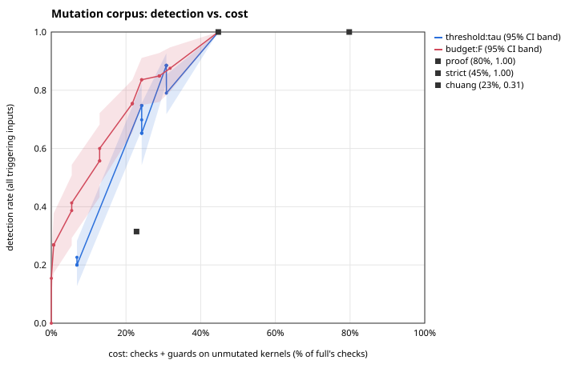

# Mutation-corpus evaluation (A3b)

Generated by `eval/mutation/report.ts` from `results/mutation/raw/` and `results/mutation/corpus.json`; analysis as preregistered in `docs/PREREGISTRATION.md` (policies and weights frozen at `b1f11bc8eef0a8c822fdc004d615cf2e54750b2d`). Do not edit by hand; run `npm run eval:mutation`.

## Corpus

451 variants generated from 16 kernels: **305 kept** (triggerable under `full`), 77 dropped as not triggerable, 0 not compilable, 69 duplicates of an earlier variant of the same kernel (identical program text) removed. 1 kept variants also ran out of loop fuel under `full` on some input.

| operator | generated | duplicate | not compilable | not triggerable | kept |
|---|---|---|---|---|---|
| start-minus-one | 12 | 0 | 0 | 0 | 12 |
| lt-to-le | 18 | 0 | 0 | 2 | 16 |
| bound-plus-one | 12 | 0 | 0 | 1 | 11 |
| index-plus-one | 59 | 0 | 0 | 12 | 47 |
| index-minus-one | 59 | 0 | 0 | 16 | 43 |
| swap-index-var | 180 | 0 | 0 | 35 | 145 |
| write-index-external | 34 | 28 | 0 | 0 | 6 |
| swap-length | 12 | 0 | 0 | 7 | 5 |
| remove-guard | 4 | 0 | 0 | 2 | 2 |
| if-lt-to-le | 2 | 0 | 0 | 2 | 0 |
| index-is-length | 59 | 41 | 0 | 0 | 18 |
| **total** | 451 | 69 | 0 | 77 | 305 |

| kernel | generated | kept | not triggerable |
|---|---|---|---|
| sumArray | 8 | 7 | 0 |
| prefixSum | 15 | 8 | 4 |
| dot | 16 | 13 | 1 |
| axpy | 30 | 23 | 0 |
| matvec | 55 | 46 | 2 |
| stencil | 28 | 14 | 10 |
| stencilV | 31 | 14 | 13 |
| smooth | 28 | 18 | 4 |
| smoothV | 35 | 23 | 6 |
| histogram | 26 | 21 | 0 |
| bubbleSort | 37 | 22 | 11 |
| insertionSort | 33 | 23 | 6 |
| binarySearch | 23 | 16 | 5 |
| gather | 26 | 20 | 1 |
| scatter | 26 | 22 | 1 |
| reverse | 34 | 15 | 13 |

## Detection, silent corruption and cost per configuration

Rates are over the 305 kept variants; detection (primary) = the configuration traps at a bounds check on **every** triggering input; detected-any = on at least one. Cost = checks + guards executed by the unmutated kernels on their benchmark inputs at scale 1, as a fraction of `full`'s checks. Brackets: 95% bootstrap CI (B = 2000, kernels resampled).

| config | detection | detected-any | silent corruption | cost (checks+guards) |
|---|---|---|---|---|
| none | 0.0% [0.0%, 0.0%] | 0.0% [0.0%, 0.0%] | 28.9% [20.8%, 37.2%] | 0.0% [0.0%, 0.0%] |
| full | 100.0% [100.0%, 100.0%] | 100.0% [100.0%, 100.0%] | 0.0% [0.0%, 0.0%] | 100.0% [100.0%, 100.0%] |
| proof | 100.0% [100.0%, 100.0%] | 100.0% [100.0%, 100.0%] | 0.0% [0.0%, 0.0%] | 79.8% [62.2%, 93.0%] |
| strict | 100.0% [100.0%, 100.0%] | 100.0% [100.0%, 100.0%] | 0.0% [0.0%, 0.0%] | 44.7% [23.5%, 66.9%] |
| balanced | 74.8% [66.4%, 82.2%] | 74.8% [66.4%, 82.2%] | 4.3% [1.5%, 8.2%] | 24.2% [10.3%, 42.8%] |
| performance | 22.6% [15.5%, 30.5%] | 23.9% [15.9%, 33.2%] | 8.9% [4.1%, 14.2%] | 6.9% [1.2%, 13.6%] |
| budget:0.25 | 26.9% [17.2%, 37.7%] | 30.5% [20.0%, 42.3%] | 18.4% [9.1%, 28.2%] | 0.6% [0.0%, 2.0%] |
| budget:0.5 | 60.0% [47.5%, 72.1%] | 62.0% [48.8%, 74.1%] | 5.2% [1.5%, 9.7%] | 12.9% [5.3%, 20.1%] |
| chuang | 31.5% [22.4%, 40.5%] | 32.8% [23.1%, 42.1%] | 0.0% [0.0%, 0.0%] | 22.8% [14.7%, 29.6%] |

## H1: strict (guards counted) costs less than proof with identical detection

- (a) cost(proof) - cost(strict) = 35.1 pp [14.7 pp, 56.7 pp]; cost(proof) 79.8%, cost(strict) 44.7%. CI entirely above 0: **yes**.
- (b) per-input outcome and check id identical between strict and proof on every kept variant: **yes**.
- **H1 supported.**

## H2: at matched cost, threshold and budget policies detect more than chuang

chuang: cost 22.8%, detection 31.5%, detected-any 32.8%.

| family | metric | family detection at chuang cost | delta vs chuang [95% CI] | resamples with chuang outside range | verdict |
|---|---|---|---|---|---|
| threshold sweep | detection (primary) | 70.6% | 39.1 pp [9.2 pp, 62.5 pp] | 33 | supported |
| threshold sweep | detected-any (secondary) | 70.7% | 37.9 pp [8.3 pp, 61.9 pp] | 33 | supported |
| budget sweep | detection (primary) | 79.1% | 47.6 pp [29.3 pp, 63.4 pp] | 33 | supported |
| budget sweep | detected-any (secondary) | 80.3% | 47.5 pp [29.4 pp, 63.0 pp] | 33 | supported |

Primary verdicts: threshold sweep: supported; budget sweep: supported. **H2 supported** (requires both families supported on the primary metric).

## Area under the detection-vs-cost curve

| family | AUC [95% CI] |
|---|---|
| threshold sweep | 0.830 [0.732, 0.911] |
| budget sweep | 0.872 [0.805, 0.932] |

Curve extended with (0, detection of `none`) and (1, detection of `full`); equal-cost points keep the higher detection.

## Sweeps

Bands: per-point 95% bootstrap CI of the detection rate (cost plotted at its full-sample value).

**Threshold sweep**

| config | cost | detection [95% CI] | detected-any | silent corruption |
|---|---|---|---|---|
| threshold:0 | 44.7% | 100.0% [100.0%, 100.0%] | 100.0% | 0.0% |
| threshold:0.05 | 44.7% | 100.0% [100.0%, 100.0%] | 100.0% | 0.0% |
| threshold:0.1 | 44.7% | 100.0% [100.0%, 100.0%] | 100.0% | 0.0% |
| threshold:0.15 | 44.7% | 100.0% [100.0%, 100.0%] | 100.0% | 0.0% |
| threshold:0.2 | 30.8% | 88.5% [82.6%, 92.7%] | 88.5% | 0.0% |
| threshold:0.25 | 30.8% | 88.5% [82.6%, 92.7%] | 88.5% | 0.0% |
| threshold:0.3 | 30.8% | 88.5% [82.6%, 92.7%] | 88.5% | 0.0% |
| threshold:0.35 | 30.8% | 88.5% [82.6%, 92.7%] | 88.5% | 0.0% |
| threshold:0.4 | 30.8% | 79.0% [71.7%, 85.3%] | 79.0% | 0.0% |
| threshold:0.45 | 24.2% | 74.8% [66.4%, 82.2%] | 74.8% | 4.3% |
| threshold:0.5 | 24.2% | 74.8% [66.4%, 82.2%] | 74.8% | 4.3% |
| threshold:0.55 | 24.2% | 74.8% [66.4%, 82.2%] | 74.8% | 4.3% |
| threshold:0.6 | 24.2% | 69.8% [59.6%, 78.9%] | 69.8% | 4.3% |
| threshold:0.65 | 24.2% | 65.2% [54.2%, 75.5%] | 65.9% | 8.9% |
| threshold:0.7 | 24.2% | 65.2% [54.2%, 75.5%] | 65.9% | 8.9% |
| threshold:0.75 | 24.2% | 65.2% [54.2%, 75.5%] | 65.9% | 8.9% |
| threshold:0.8 | 6.9% | 22.6% [15.5%, 30.5%] | 23.9% | 8.9% |
| threshold:0.85 | 6.9% | 20.0% [12.8%, 28.3%] | 21.3% | 11.5% |
| threshold:0.9 | 6.9% | 20.0% [12.8%, 28.3%] | 21.3% | 11.5% |
| threshold:0.95 | 6.9% | 20.0% [12.8%, 28.3%] | 21.3% | 11.5% |
| threshold:1 | 6.9% | 20.0% [12.8%, 28.3%] | 21.3% | 11.5% |

**Budget sweep**

| config | cost | detection [95% CI] | detected-any | silent corruption |
|---|---|---|---|---|
| budget:0 | 0.0% | 0.0% [0.0%, 0.0%] | 0.0% | 28.9% |
| budget:0.05 | 0.0% | 15.4% [9.8%, 21.8%] | 18.7% | 26.9% |
| budget:0.1 | 0.6% | 26.9% [17.2%, 37.7%] | 30.5% | 18.4% |
| budget:0.15 | 0.6% | 26.9% [17.2%, 37.7%] | 30.5% | 18.4% |
| budget:0.2 | 0.6% | 26.9% [17.2%, 37.7%] | 30.5% | 18.4% |
| budget:0.25 | 0.6% | 26.9% [17.2%, 37.7%] | 30.5% | 18.4% |
| budget:0.3 | 5.5% | 38.7% [26.7%, 50.8%] | 40.3% | 12.5% |
| budget:0.35 | 5.5% | 41.3% [29.2%, 54.4%] | 43.0% | 11.1% |
| budget:0.4 | 12.9% | 55.7% [43.3%, 68.2%] | 57.7% | 5.2% |
| budget:0.45 | 12.9% | 55.7% [43.3%, 68.2%] | 57.7% | 5.2% |
| budget:0.5 | 12.9% | 60.0% [47.5%, 72.1%] | 62.0% | 5.2% |
| budget:0.55 | 21.7% | 75.4% [65.5%, 83.5%] | 76.7% | 1.3% |
| budget:0.6 | 21.7% | 75.4% [65.5%, 83.5%] | 76.7% | 1.3% |
| budget:0.65 | 21.7% | 75.4% [65.5%, 83.5%] | 76.7% | 1.3% |
| budget:0.7 | 24.2% | 83.6% [74.9%, 91.1%] | 84.6% | 0.3% |
| budget:0.75 | 24.2% | 83.6% [74.9%, 91.1%] | 84.6% | 0.3% |
| budget:0.8 | 28.9% | 84.9% [76.0%, 92.8%] | 85.9% | 0.0% |
| budget:0.85 | 28.9% | 84.9% [76.0%, 92.8%] | 85.9% | 0.0% |
| budget:0.9 | 28.9% | 84.9% [76.0%, 92.8%] | 85.9% | 0.0% |
| budget:0.95 | 31.8% | 87.5% [79.6%, 94.7%] | 88.5% | 0.0% |
| budget:1 | 44.7% | 100.0% [100.0%, 100.0%] | 100.0% | 0.0% |

## Silent corruption by mutation class: which omitted sites caused it

For each silent-corruption run, the site is the bounds check that fired under `full` on the same input (the preregistered attribution); the columns give that site's decision under the configuration, and its P, C, W, R. When that site is a **read**, omitting it does not corrupt anything by itself: execution continues past it and a later write corrupts memory. That write is among the "omitted writes in variant" column (secondary attribution, added after the first run; see the Deviations in docs/PREREGISTRATION.md). Counts are variants (and triggering inputs). Main configurations only; `results/mutation/raw/silent.csv` has every configuration.

Decisions of the responsible sites over all silent-corruption cases in the main configurations: omit 204. Of these cases, 38 are attributed to a read site and 166 to a write site.

**start-minus-one**

| config | kernel | site | access | P | C | W | R | decision | omitted writes in variant | variants (inputs) |
|---|---|---|---|---|---|---|---|---|---|---|
| none | axpy | 4:26 | read | 0 | 1 | 0 | 0.35 | omit | 4:9 | 1 (179) |
| none | bubbleSort | 6:26 | read | 0 | 0.5 | 0 | 0.175 | omit | 8:17 9:17 | 1 (200) |
| none | matvec | 6:23 | read | 1 | 1 | 0 | 0.75 | omit | 8:9 | 1 (157) |
| none | matvec | 8:9 | write | 0 | 1 | 1 | 0.6 | omit | 8:9 | 1 (43) |
| balanced | bubbleSort | 6:26 | read | 0 | 0.5 | 0 | 0.175 | omit | 8:17 9:17 | 1 (200) |
| performance | axpy | 4:26 | read | 0 | 1 | 0 | 0.35 | omit | 4:9 | 1 (179) |
| performance | bubbleSort | 6:26 | read | 0 | 0.5 | 0 | 0.175 | omit | 8:17 9:17 | 1 (200) |
| performance | matvec | 6:23 | read | 1 | 1 | 0 | 0.75 | omit | 8:9 | 1 (157) |
| performance | matvec | 8:9 | write | 0 | 1 | 1 | 0.6 | omit | 8:9 | 1 (43) |
| budget:0.25 | axpy | 4:26 | read | 0 | 1 | 0 | 0.35 | omit | 4:9 | 1 (179) |
| budget:0.25 | bubbleSort | 6:26 | read | 0 | 0.5 | 0 | 0.175 | omit | 8:17 9:17 | 1 (200) |
| budget:0.5 | bubbleSort | 6:26 | read | 0 | 0.5 | 0 | 0.175 | omit | 9:17 | 1 (200) |

**lt-to-le**

| config | kernel | site | access | P | C | W | R | decision | omitted writes in variant | variants (inputs) |
|---|---|---|---|---|---|---|---|---|---|---|
| none | axpy | 4:26 | read | 0 | 1 | 0 | 0.35 | omit | 4:9 | 1 (25) |
| none | bubbleSort | 6:26 | read | 0 | 1 | 0 | 0.35 | omit | 8:17 9:17 | 1 (184) |
| none | insertionSort | 4:24 | read | 0 | 1 | 0 | 0.35 | omit | 13:21 20:9 | 1 (200) |
| none | matvec | 6:23 | read | 1 | 1 | 0 | 0.75 | omit | 8:9 | 1 (157) |
| none | matvec | 8:9 | write | 0 | 1 | 1 | 0.6 | omit | 8:9 | 1 (43) |
| none | prefixSum | 5:34 | read | 0 | 1 | 0 | 0.35 | omit | 5:9 | 1 (189) |
| performance | axpy | 4:26 | read | 0 | 1 | 0 | 0.35 | omit | 4:9 | 1 (25) |
| performance | bubbleSort | 6:26 | read | 0 | 1 | 0 | 0.35 | omit | 8:17 9:17 | 1 (184) |
| performance | insertionSort | 4:24 | read | 0 | 1 | 0 | 0.35 | omit | 13:21 20:9 | 1 (200) |
| performance | matvec | 6:23 | read | 1 | 1 | 0 | 0.75 | omit | 8:9 | 1 (157) |
| performance | matvec | 8:9 | write | 0 | 1 | 1 | 0.6 | omit | 8:9 | 1 (43) |
| performance | prefixSum | 5:34 | read | 0 | 1 | 0 | 0.35 | omit | 5:9 | 1 (189) |
| budget:0.25 | axpy | 4:26 | read | 0 | 1 | 0 | 0.35 | omit | 4:9 | 1 (25) |
| budget:0.25 | bubbleSort | 6:26 | read | 0 | 1 | 0 | 0.35 | omit | 8:17 9:17 | 1 (184) |
| budget:0.25 | prefixSum | 5:34 | read | 0 | 1 | 0 | 0.35 | omit | 5:9 | 1 (189) |
| budget:0.5 | bubbleSort | 6:26 | read | 0 | 1 | 0 | 0.35 | omit | 9:17 | 1 (184) |

**bound-plus-one**

| config | kernel | site | access | P | C | W | R | decision | omitted writes in variant | variants (inputs) |
|---|---|---|---|---|---|---|---|---|---|---|
| none | bubbleSort | 6:26 | read | 0 | 0.5 | 0 | 0.175 | omit | 8:17 9:17 | 1 (184) |
| none | insertionSort | 4:24 | read | 0 | 0.5 | 0 | 0.175 | omit | 13:21 20:9 | 1 (200) |
| none | prefixSum | 5:34 | read | 0 | 0.5 | 0 | 0.175 | omit | 5:9 | 1 (189) |
| balanced | bubbleSort | 6:26 | read | 0 | 0.5 | 0 | 0.175 | omit | 8:17 9:17 | 1 (184) |
| balanced | insertionSort | 4:24 | read | 0 | 0.5 | 0 | 0.175 | omit | 13:21 20:9 | 1 (200) |
| balanced | prefixSum | 5:34 | read | 0 | 0.5 | 0 | 0.175 | omit | 5:9 | 1 (189) |
| performance | bubbleSort | 6:26 | read | 0 | 0.5 | 0 | 0.175 | omit | 8:17 9:17 | 1 (184) |
| performance | insertionSort | 4:24 | read | 0 | 0.5 | 0 | 0.175 | omit | 13:21 20:9 | 1 (200) |
| performance | prefixSum | 5:34 | read | 0 | 0.5 | 0 | 0.175 | omit | 5:9 | 1 (189) |
| budget:0.25 | bubbleSort | 6:26 | read | 0 | 0.5 | 0 | 0.175 | omit | 8:17 9:17 | 1 (184) |
| budget:0.25 | prefixSum | 5:34 | read | 0 | 0.5 | 0 | 0.175 | omit | 5:9 | 1 (189) |
| budget:0.5 | bubbleSort | 6:26 | read | 0 | 0.5 | 0 | 0.175 | omit | 9:17 | 1 (184) |

**index-plus-one**

| config | kernel | site | access | P | C | W | R | decision | omitted writes in variant | variants (inputs) |
|---|---|---|---|---|---|---|---|---|---|---|
| none | axpy | 4:9 | write | 0 | 0.5 | 1 | 0.425 | omit | 4:9 | 1 (30) |
| none | bubbleSort | 9:17 | write | 0 | 1 | 1 | 0.6 | omit | 8:17 9:17 | 1 (68) |
| none | gather | 4:9 | write | 0 | 0.5 | 1 | 0.425 | omit | 4:9 | 1 (200) |
| none | histogram | 5:9 | write | 1 | 1 | 1 | 1 | omit | 5:9 | 1 (147) |
| none | insertionSort | 13:21 | write | 0 | 0.5 | 1 | 0.425 | omit | 13:21 20:9 | 1 (89) |
| none | insertionSort | 20:9 | write | 0 | 0.5 | 1 | 0.425 | omit | 13:21 20:9 | 1 (173) |
| none | matvec | 8:9 | write | 0 | 0.5 | 1 | 0.425 | omit | 8:9 | 1 (200) |
| none | prefixSum | 5:9 | write | 0 | 0.5 | 1 | 0.425 | omit | 5:9 | 1 (179) |
| none | reverse | 8:9 | write | 1 | 1 | 1 | 1 | omit | 7:9 8:9 | 1 (193) |
| none | scatter | 4:9 | write | 1 | 1 | 1 | 1 | omit | 4:9 | 1 (106) |
| none | smooth | 11:9 | write | 1 | 1 | 1 | 1 | omit | 11:9 | 1 (53) |
| none | smoothV | 14:9 | write | 1 | 1 | 1 | 1 | omit | 14:9 | 1 (45) |
| balanced | axpy | 4:9 | write | 0 | 0.5 | 1 | 0.425 | omit | 4:9 | 1 (30) |
| balanced | gather | 4:9 | write | 0 | 0.5 | 1 | 0.425 | omit | 4:9 | 1 (200) |
| balanced | insertionSort | 13:21 | write | 0 | 0.5 | 1 | 0.425 | omit | 13:21 20:9 | 1 (89) |
| balanced | insertionSort | 20:9 | write | 0 | 0.5 | 1 | 0.425 | omit | 13:21 20:9 | 1 (173) |
| balanced | matvec | 8:9 | write | 0 | 0.5 | 1 | 0.425 | omit | 8:9 | 1 (200) |
| balanced | prefixSum | 5:9 | write | 0 | 0.5 | 1 | 0.425 | omit | 5:9 | 1 (179) |
| performance | axpy | 4:9 | write | 0 | 0.5 | 1 | 0.425 | omit | 4:9 | 1 (30) |
| performance | bubbleSort | 9:17 | write | 0 | 1 | 1 | 0.6 | omit | 8:17 9:17 | 1 (68) |
| performance | gather | 4:9 | write | 0 | 0.5 | 1 | 0.425 | omit | 4:9 | 1 (200) |
| performance | insertionSort | 13:21 | write | 0 | 0.5 | 1 | 0.425 | omit | 13:21 20:9 | 1 (89) |
| performance | insertionSort | 20:9 | write | 0 | 0.5 | 1 | 0.425 | omit | 13:21 20:9 | 1 (173) |
| performance | matvec | 8:9 | write | 0 | 0.5 | 1 | 0.425 | omit | 8:9 | 1 (200) |
| performance | prefixSum | 5:9 | write | 0 | 0.5 | 1 | 0.425 | omit | 5:9 | 1 (179) |
| budget:0.25 | axpy | 4:9 | write | 0 | 0.5 | 1 | 0.425 | omit | 4:9 | 1 (30) |
| budget:0.25 | bubbleSort | 9:17 | write | 0 | 1 | 1 | 0.6 | omit | 8:17 9:17 | 1 (68) |
| budget:0.25 | gather | 4:9 | write | 0 | 0.5 | 1 | 0.425 | omit | 4:9 | 1 (200) |
| budget:0.25 | histogram | 5:9 | write | 1 | 1 | 1 | 1 | omit | 5:9 | 1 (147) |
| budget:0.25 | insertionSort | 13:21 | write | 0 | 0.5 | 1 | 0.425 | omit | 13:21 | 1 (89) |
| budget:0.25 | prefixSum | 5:9 | write | 0 | 0.5 | 1 | 0.425 | omit | 5:9 | 1 (179) |
| budget:0.25 | reverse | 8:9 | write | 1 | 1 | 1 | 1 | omit | 7:9 8:9 | 1 (193) |
| budget:0.25 | scatter | 4:9 | write | 1 | 1 | 1 | 1 | omit | 4:9 | 1 (106) |
| budget:0.5 | gather | 4:9 | write | 0 | 0.5 | 1 | 0.425 | omit | 4:9 | 1 (200) |
| budget:0.5 | insertionSort | 13:21 | write | 0 | 0.5 | 1 | 0.425 | omit | 13:21 | 1 (89) |

**index-minus-one**

| config | kernel | site | access | P | C | W | R | decision | omitted writes in variant | variants (inputs) |
|---|---|---|---|---|---|---|---|---|---|---|
| none | axpy | 4:9 | write | 0 | 1 | 1 | 0.6 | omit | 4:9 | 1 (168) |
| none | bubbleSort | 8:17 | write | 0 | 1 | 1 | 0.6 | omit | 8:17 9:17 | 1 (142) |
| none | gather | 4:9 | write | 0 | 1 | 1 | 0.6 | omit | 4:9 | 1 (200) |
| none | histogram | 5:9 | write | 1 | 1 | 1 | 1 | omit | 5:9 | 1 (145) |
| none | insertionSort | 20:9 | write | 0 | 1 | 1 | 0.6 | omit | 13:21 20:9 | 1 (177) |
| none | matvec | 8:9 | write | 0 | 1 | 1 | 0.6 | omit | 8:9 | 1 (200) |
| none | reverse | 7:9 | write | 0 | 1 | 1 | 0.6 | omit | 7:9 8:9 | 1 (193) |
| none | scatter | 4:9 | write | 1 | 1 | 1 | 1 | omit | 4:9 | 1 (117) |
| none | smooth | 11:9 | write | 1 | 1 | 1 | 1 | omit | 11:9 | 1 (53) |
| none | smoothV | 14:9 | write | 1 | 1 | 1 | 1 | omit | 14:9 | 1 (45) |
| performance | axpy | 4:9 | write | 0 | 1 | 1 | 0.6 | omit | 4:9 | 1 (168) |
| performance | bubbleSort | 8:17 | write | 0 | 1 | 1 | 0.6 | omit | 8:17 9:17 | 1 (142) |
| performance | gather | 4:9 | write | 0 | 1 | 1 | 0.6 | omit | 4:9 | 1 (200) |
| performance | insertionSort | 20:9 | write | 0 | 1 | 1 | 0.6 | omit | 13:21 20:9 | 1 (177) |
| performance | matvec | 8:9 | write | 0 | 1 | 1 | 0.6 | omit | 8:9 | 1 (200) |
| performance | reverse | 7:9 | write | 0 | 1 | 1 | 0.6 | omit | 7:9 | 1 (193) |
| budget:0.25 | axpy | 4:9 | write | 0 | 1 | 1 | 0.6 | omit | 4:9 | 1 (168) |
| budget:0.25 | bubbleSort | 8:17 | write | 0 | 1 | 1 | 0.6 | omit | 8:17 9:17 | 1 (142) |
| budget:0.25 | gather | 4:9 | write | 0 | 1 | 1 | 0.6 | omit | 4:9 | 1 (200) |
| budget:0.25 | histogram | 5:9 | write | 1 | 1 | 1 | 1 | omit | 5:9 | 1 (145) |
| budget:0.25 | reverse | 7:9 | write | 0 | 1 | 1 | 0.6 | omit | 7:9 8:9 | 1 (193) |
| budget:0.25 | scatter | 4:9 | write | 1 | 1 | 1 | 1 | omit | 4:9 | 1 (117) |
| budget:0.5 | gather | 4:9 | write | 0 | 1 | 1 | 0.6 | omit | 4:9 | 1 (200) |
| budget:0.5 | reverse | 7:9 | write | 0 | 1 | 1 | 0.6 | omit | 7:9 | 1 (193) |

**swap-index-var**

| config | kernel | site | access | P | C | W | R | decision | omitted writes in variant | variants (inputs) |
|---|---|---|---|---|---|---|---|---|---|---|
| none | axpy | 4:9 | write | 1 | 0.5 | 1 | 0.825 | omit | 4:9 | 1 (30) |
| none | axpy | 4:9 | write | 1 | 1 | 1 | 1 | omit | 4:9 | 3 (409) |
| none | bubbleSort | 8:17 | write | 1 | 1 | 1 | 1 | omit | 8:17 9:17 | 3 (256) |
| none | bubbleSort | 9:17 | write | 1 | 1 | 1 | 1 | omit | 8:17 9:17 | 3 (291) |
| none | gather | 4:9 | write | 1 | 0.5 | 1 | 0.825 | omit | 4:9 | 1 (200) |
| none | gather | 4:9 | write | 1 | 1 | 1 | 1 | omit | 4:9 | 2 (243) |
| none | histogram | 5:9 | write | 0 | 0.5 | 1 | 0.425 | omit | 5:9 | 1 (134) |
| none | histogram | 5:9 | write | 1 | 0.5 | 1 | 0.825 | omit | 5:9 | 1 (56) |
| none | histogram | 5:9 | write | 1 | 1 | 1 | 1 | omit | 5:9 | 1 (189) |
| none | insertionSort | 13:21 | write | 0 | 0.5 | 1 | 0.425 | omit | 13:21 20:9 | 1 (78) |
| none | insertionSort | 13:21 | write | 1 | 1 | 1 | 1 | omit | 13:21 20:9 | 3 (285) |
| none | insertionSort | 20:9 | write | 0 | 0.5 | 1 | 0.425 | omit | 13:21 20:9 | 1 (187) |
| none | insertionSort | 20:9 | write | 1 | 1 | 1 | 1 | omit | 13:21 20:9 | 2 (255) |
| none | matvec | 8:9 | write | 1 | 0.5 | 1 | 0.825 | omit | 8:9 | 1 (200) |
| none | matvec | 8:9 | write | 1 | 1 | 1 | 1 | omit | 8:9 | 5 (505) |
| none | prefixSum | 5:9 | write | 1 | 0.5 | 1 | 0.825 | omit | 5:9 | 1 (179) |
| none | reverse | 7:9 | write | 1 | 1 | 1 | 1 | omit | 7:9 8:9 | 2 (248) |
| none | reverse | 8:9 | write | 1 | 1 | 1 | 1 | omit | 7:9 8:9 | 2 (248) |
| none | scatter | 4:13 | read | 1 | 1 | 0 | 0.75 | omit | 4:9 | 1 (2) |
| none | smooth | 11:9 | write | 1 | 1 | 1 | 1 | omit | 11:9 | 4 (606) |
| none | smoothV | 14:9 | write | 1 | 1 | 1 | 1 | omit | 14:9 | 6 (656) |
| none | stencil | 5:9 | write | 1 | 1 | 1 | 1 | omit | 5:9 | 2 (372) |
| none | stencilV | 6:9 | write | 1 | 1 | 1 | 1 | omit | 6:9 | 2 (378) |
| balanced | histogram | 5:9 | write | 0 | 0.5 | 1 | 0.425 | omit | 5:9 | 1 (134) |
| balanced | insertionSort | 13:21 | write | 0 | 0.5 | 1 | 0.425 | omit | 13:21 20:9 | 1 (78) |
| balanced | insertionSort | 20:9 | write | 0 | 0.5 | 1 | 0.425 | omit | 13:21 20:9 | 1 (187) |
| performance | histogram | 5:9 | write | 0 | 0.5 | 1 | 0.425 | omit | 5:9 | 1 (134) |
| performance | insertionSort | 13:21 | write | 0 | 0.5 | 1 | 0.425 | omit | 13:21 20:9 | 1 (78) |
| performance | insertionSort | 20:9 | write | 0 | 0.5 | 1 | 0.425 | omit | 13:21 20:9 | 1 (187) |
| budget:0.25 | axpy | 4:9 | write | 1 | 0.5 | 1 | 0.825 | omit | 4:9 | 1 (30) |
| budget:0.25 | axpy | 4:9 | write | 1 | 1 | 1 | 1 | omit | 4:9 | 3 (409) |
| budget:0.25 | bubbleSort | 8:17 | write | 1 | 1 | 1 | 1 | omit | 8:17 9:17 | 3 (254) |
| budget:0.25 | bubbleSort | 9:17 | write | 1 | 1 | 1 | 1 | omit | 8:17 9:17 | 3 (286) |
| budget:0.25 | gather | 4:9 | write | 1 | 0.5 | 1 | 0.825 | omit | 4:9 | 1 (200) |
| budget:0.25 | gather | 4:9 | write | 1 | 1 | 1 | 1 | omit | 4:9 | 2 (243) |
| budget:0.25 | histogram | 5:9 | write | 0 | 0.5 | 1 | 0.425 | omit | 5:9 | 1 (134) |
| budget:0.25 | histogram | 5:9 | write | 1 | 0.5 | 1 | 0.825 | omit | 5:9 | 1 (56) |
| budget:0.25 | histogram | 5:9 | write | 1 | 1 | 1 | 1 | omit | 5:9 | 1 (189) |
| budget:0.25 | insertionSort | 13:21 | write | 0 | 0.5 | 1 | 0.425 | omit | 13:21 | 1 (78) |
| budget:0.25 | insertionSort | 13:21 | write | 1 | 1 | 1 | 1 | omit | 13:21 | 3 (273) |
| budget:0.25 | prefixSum | 5:9 | write | 1 | 0.5 | 1 | 0.825 | omit | 5:9 | 1 (179) |
| budget:0.25 | reverse | 7:9 | write | 1 | 1 | 1 | 1 | omit | 7:9 8:9 | 2 (247) |
| budget:0.25 | reverse | 8:9 | write | 1 | 1 | 1 | 1 | omit | 7:9 8:9 | 2 (244) |
| budget:0.25 | scatter | 4:13 | read | 1 | 1 | 0 | 0.75 | omit | 4:9 | 1 (2) |
| budget:0.25 | stencil | 5:9 | write | 1 | 1 | 1 | 1 | omit | 5:9 | 2 (372) |
| budget:0.25 | stencilV | 6:9 | write | 1 | 1 | 1 | 1 | omit | 6:9 | 2 (378) |
| budget:0.5 | histogram | 5:9 | write | 0 | 0.5 | 1 | 0.425 | omit | 5:9 | 1 (134) |
| budget:0.5 | insertionSort | 13:21 | write | 0 | 0.5 | 1 | 0.425 | omit | 13:21 | 1 (78) |
| budget:0.5 | insertionSort | 13:21 | write | 1 | 1 | 1 | 1 | omit | 13:21 | 3 (273) |

**write-index-external**

| config | kernel | site | access | P | C | W | R | decision | omitted writes in variant | variants (inputs) |
|---|---|---|---|---|---|---|---|---|---|---|
| none | bubbleSort | 9:17 | write | 1 | 1 | 1 | 1 | omit | 8:17 9:17 | 1 (174) |
| none | insertionSort | 13:21 | write | 1 | 0.5 | 1 | 0.825 | omit | 13:21 20:9 | 1 (178) |
| none | insertionSort | 20:9 | write | 1 | 0.5 | 1 | 0.825 | omit | 13:21 20:9 | 1 (187) |
| none | scatter | 4:9 | write | 1 | 0.5 | 1 | 0.825 | omit | 4:9 | 1 (41) |
| none | scatter | 4:9 | write | 1 | 1 | 1 | 1 | omit | 4:9 | 2 (225) |
| budget:0.25 | bubbleSort | 9:17 | write | 1 | 1 | 1 | 1 | omit | 8:17 9:17 | 1 (174) |
| budget:0.25 | insertionSort | 13:21 | write | 1 | 0.5 | 1 | 0.825 | omit | 13:21 | 1 (178) |
| budget:0.25 | scatter | 4:9 | write | 1 | 0.5 | 1 | 0.825 | omit | 4:9 | 1 (41) |
| budget:0.25 | scatter | 4:9 | write | 1 | 1 | 1 | 1 | omit | 4:9 | 2 (225) |
| budget:0.5 | insertionSort | 13:21 | write | 1 | 0.5 | 1 | 0.825 | omit | 13:21 | 1 (178) |
| budget:0.5 | scatter | 4:9 | write | 1 | 0.5 | 1 | 0.825 | omit | 4:9 | 1 (41) |
| budget:0.5 | scatter | 4:9 | write | 1 | 1 | 1 | 1 | omit | 4:9 | 2 (225) |

**swap-length**: no silent corruption in any main configuration.

**remove-guard**: no silent corruption in any main configuration.

**if-lt-to-le**: no silent corruption in any main configuration.

**index-is-length**: no silent corruption in any main configuration.

## Determinism

The evaluation was run twice in separate passes over the same corpus. `cost.csv` byte-identical, `outcomes.csv` byte-identical, `silent.csv` byte-identical. Detection results are identical between the two runs.

## Caveats

- Variants come from 16 small kernels written for this project; with only 16 clusters the kernel-resampling CIs are wide and approximate.
- Pooled rates weight kernels by their number of kept variants (matvec has the most).
- Cost is measured on the unmutated kernels on one benchmark input each.
- Fuzzed inputs are small (arrays of length 0-16); a variant that only misbehaves on larger inputs is counted as not triggerable.
